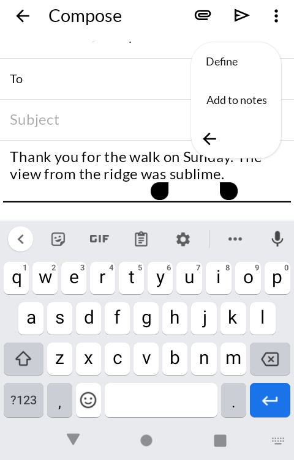
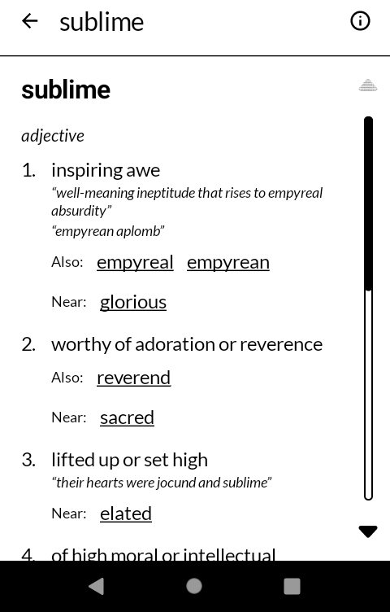
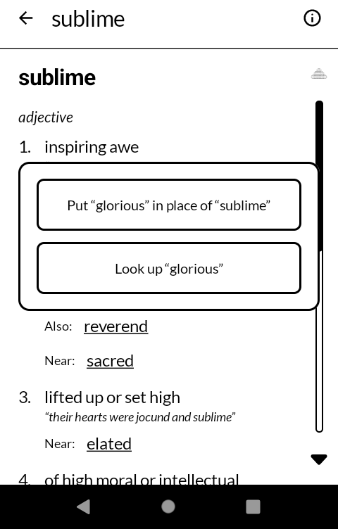
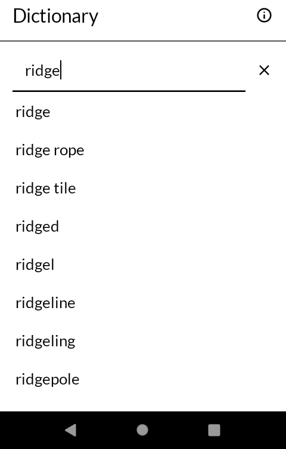

# 字引 jibiki — Dictionary

An English dictionary and thesaurus that lives in the menu over selected text. Select a word in
any app, choose **Define**, and read what it means; press one of the other words for it, and
that word goes back into what you were writing. Built for the
[Mudita Kompakt](https://mudita.com/products/kompakt/), and it will install on any Android 12
device.

*Jibiki* is 字引 — the character-puller, the plain old word for the book you pull a word out of.

Not a fork. Written from scratch in Kotlin and Jetpack Compose, using Mudita's own
[MMD](https://github.com/mudita/MMD) design system so it looks like the apps the phone already
ships with.

| | |
|---|---|
|  |  |
|  |  |

## What it does

- **Define, in the menu over selected text** in any app that offers other apps' text actions.
  The word's page opens over the app it came from, and Back returns there.
- **What a word means**, sense by sense, as a noun, a verb or whatever else it is, with
  examples of it in use and how it is said.
- **A thesaurus on the same page.** Under each meaning: other words for it, the opposite, words
  close to it, and the broader word it is a kind of. Every one of them can be pressed.
- **Swaps a word in.** When the selection came from a field you are writing in, pressing a word
  offers to put it there in place of the one you selected, capitalised the same way.
- **Finds the word under its endings.** *Ran* opens *run*, *geese* opens *goose*, *stopped*
  opens *stop*, and *running* shows both *running* and *run*, with a line at the top to jump
  between them.
- **A search field of its own**, with the words that begin with what you have typed and the
  ones you looked up lately.

## What it does not do

- **Nothing leaves the phone.** The whole word list is inside the app, about 136,000 words.
  The app asks for no permissions at all, not even the internet.
- **English only.** One language, done properly, beats several done thinly.
- **No word of the day, no history synced anywhere, no account.** The recent list is kept on
  the phone and goes when the app does.

## Which apps show Define

Since Android 11, an app sees other apps' text actions only if it says in its manifest that it
wants to. Most apps built on Android's ordinary text views do; some do not, and there is
nothing this app can do about that from its side.

Among the apps made alongside it, Email ([tayori](https://github.com/wanderwildwood/tayori))
and Clippings ([kirinuki](https://github.com/wanderwildwood/kirinuki)) already offer it, and
Typewriter ([dajiki](https://github.com/wanderwildwood/dajiki)) and Notes do from their next
releases. Swapping
a word in works where the app asks for the result back. Email's compose screen does;
Typewriter and Notes, being Jetpack Compose, open Define to read only.

## The word list

[Open English WordNet](https://github.com/globalwordnet/english-wordnet) 2025, the maintained
continuation of Princeton WordNet, under CC BY 4.0. `data/build-db.py` turns its XML release
into the SQLite file the app ships, keeping only what the app shows:

    ./data/build-db.py english-wordnet-2025.xml.gz wordnet.db
    gzip -9 -n -c wordnet.db > app/src/main/assets/wordnet.db.gz

The file is unpacked into the app's own storage the first time it opens, which takes a moment
once and never again until a new edition ships.

## Building

```
./gradlew assembleDebug
```

A release build needs a keystore at `signing/signing.keystore` with a matching
`signing/signing.properties`. There is no fallback key in this repository: without one, a
release build comes out unsigned rather than wrongly signed.

## Getting it, and keeping it

Download <https://github.com/wanderwildwood/jibiki/releases/latest/download/jibiki.apk> and
sideload it. That address always points at the newest release, and every release publishes a
`.sha256` beside the APK if you would rather check than trust.

For updates without doing this by hand, add this repository to
[Obtainium](https://github.com/ImranR98/Obtainium):

    https://github.com/wanderwildwood/jibiki

## Licence

GPL-3.0-only. See [LICENSE](LICENSE).

Copyright (C) 2026 wander wildwood

This program is free software: you can redistribute it and/or modify it under the terms of the
GNU General Public License as published by the Free Software Foundation, version 3.

This program is distributed in the hope that it will be useful, but WITHOUT ANY WARRANTY;
without even the implied warranty of MERCHANTABILITY or FITNESS FOR A PARTICULAR PURPOSE. See
the GNU General Public License for more details.

You should have received a copy of the GNU General Public License along with this program. If
not, see <https://www.gnu.org/licenses/>.

The word list is Open English WordNet 2025, CC BY 4.0, from Princeton WordNet 3.0. Icons are
from Material Symbols, Apache 2.0.
